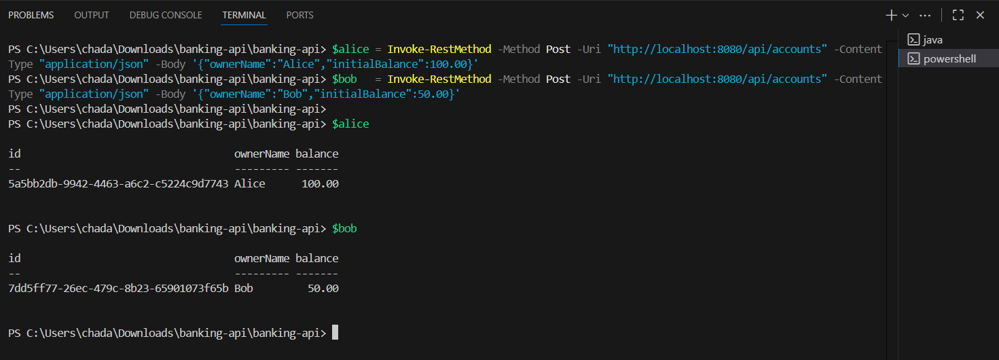
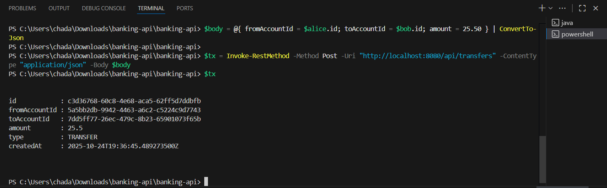
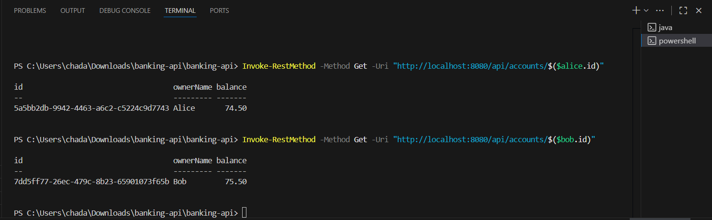
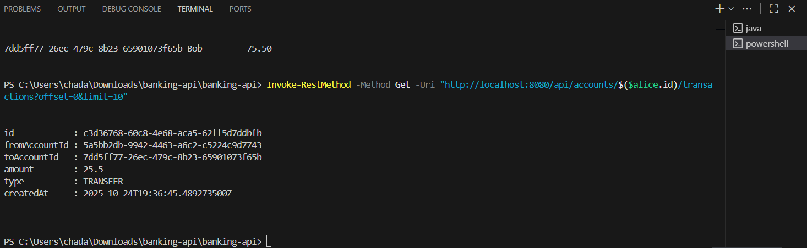
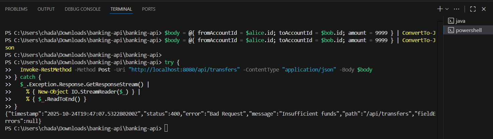

# Banking Transactions API (Spring Boot, Java 17)

Simple in-memory banking API demonstrating a 3-layer architecture (Controller → Service → Repository), DTOs, validation, dependency injection, and error handling.

## Features
- Create account with initial balance (`POST /api/accounts`)
- Transfer funds between accounts (`POST /api/transfers`)
- Get transaction history for an account (`GET /api/accounts/{id}/transactions`)
- Input validation with helpful error messages
- Global exception handler that returns consistent JSON (400/404/500)
- In-memory storage (no DB) using `ConcurrentHashMap` + lists
- Thread-safe transfers (per-account locks; deadlock-safe ordering)

---

## Requirements
- Java 17+
- Maven 3.9+

Verify installation:
```powershell
mvn -v
java -version
```

---

## Download / Open the project
1. Download or clone from GitHub:
   ```powershell
   git clone https://github.com/ChadaBendriss/banking-api.git
   cd banking-api
   ```
2. Or download via Spring Initializr, then open in **VS Code**.

---

## Run the app (two terminals)

### Terminal A — start the app
```powershell
mvn spring-boot:run
```
Expected:  
`Tomcat started on port(s): 8080`


### Terminal B — test with PowerShell

#### (Optional) health check
```powershell
Invoke-RestMethod -Method Get -Uri "http://localhost:8080/api/health"
```
→ `OK`

#### Create two accounts
```powershell
$alice = Invoke-RestMethod -Method Post -Uri "http://localhost:8080/api/accounts" -ContentType "application/json" -Body '{"ownerName":"Alice","initialBalance":100.00}'
$bob   = Invoke-RestMethod -Method Post -Uri "http://localhost:8080/api/accounts" -ContentType "application/json" -Body '{"ownerName":"Bob","initialBalance":50.00}'
$alice
$bob
```
**Expected:** IDs and balances

#### Transfer 25.50 from Alice → Bob
```powershell
$body = @{ fromAccountId = $alice.id; toAccountId = $bob.id; amount = 25.50 } | ConvertTo-Json
$tx = Invoke-RestMethod -Method Post -Uri "http://localhost:8080/api/transfers" -ContentType "application/json" -Body $body
$tx
```

#### Check balances
```powershell
Invoke-RestMethod -Method Get -Uri "http://localhost:8080/api/accounts/$($alice.id)"
Invoke-RestMethod -Method Get -Uri "http://localhost:8080/api/accounts/$($bob.id)"
```

#### History
```powershell
Invoke-RestMethod -Method Get -Uri "http://localhost:8080/api/accounts/$($alice.id)/transactions?offset=0&limit=10"
```

#### Error: insufficient funds (expected 400)
```powershell
$body = @{ fromAccountId = $alice.id; toAccountId = $bob.id; amount = 9999 } | ConvertTo-Json
try {
  Invoke-RestMethod -Method Post -Uri "http://localhost:8080/api/transfers" -ContentType "application/json" -Body $body
} catch {
  $_.Exception.Response.GetResponseStream() | % { New-Object IO.StreamReader($_) } | % { $_.ReadToEnd() }
}
```

---

## Screenshots
Here are the screenshots in `docs/screenshots/` :

### Create Accounts
Creating Alice and Bob using POST `/api/accounts`:
- 

### Successful Transfer
Transferring 25.50 from Alice → Bob:
- 

### Updated Balances
Checking new balances for Alice and Bob:
- 

### Transaction History
Fetching Alice’s recent transactions:
- 

### Insufficient Funds Error
Attempting to transfer more than the balance — expected 400 Bad Request:
- 

---

## Project Structure
```
src/main/java/com/example/banking/
  controller/   → REST endpoints
  service/      → business logic
  repository/   → interfaces + in-memory impl
    impl/
  model/        → Account, Transaction
  dto/          → request/response DTOs
  exception/    → custom exceptions + global handler
```

---

## Assumptions
- BigDecimal for money
- In-memory data resets each run
- Per-account locking prevents race conditions
- Global JSON error format with @RestControllerAdvice
